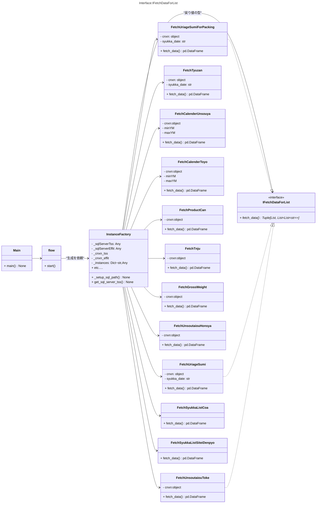
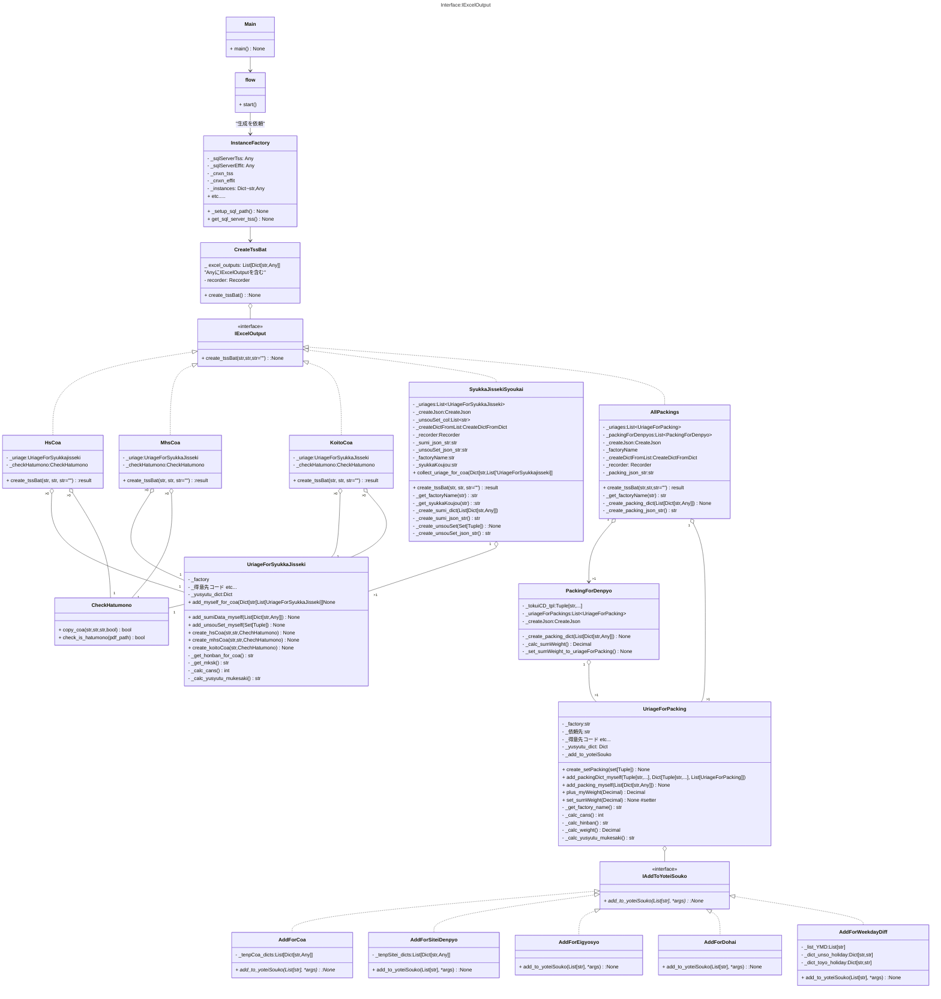

# tss_syukkaについて
## システム概要
### 動作環境
- OS  
    - Windows11(main.py)
- インストール先
    - 尾頭PC WSL2(Ubuntu)で開発
### 構築システム
- メインシステム: Python3.10
- Windowsスクリプト(   )
### ソースコード
GitHub Publicリポジトリで公開 
[GitHub_ https://github.com/ogashira/tss_syukka](https://github.com/ogashira/tss_syukka)
### 起動方法
##### tss_syukka
- `Winボタン+R -> tss_syukka入力 -> Enter`または`cmdにて、 pushd \\wsl$\Ubuntu\home\oga\projects\tss_syukka\`デイレクトリ内にて`python main.py`で実行
### クラス

| クラス名                   | interface         | 仕事 |
| :---:                      | :---:             | :--- |
| flow                       |                   | def start() プログラムの流れ    |
| InstanceFactory            |                   | インスタンスを作る |
| FetchUriageSumiForPacking  | IFetchDataForList | 業務_packing用の売上データをfetch |
| FetchUriageSumi            | IFetchDataForList | 出荷実績照会用の売上データをfetch |
| FetchTyuzan                | IFetchDataForList | 注残確認用のデータをfetch |
| FetchCalenderUnsouya       | IFetchDataForList | 運送業者の稼働日カレンダーをfetch |
| FetchCalenderToyo          | IFetchDataForList | 東洋の稼働日カレンダーをfetch |
| FetchProductCan            | IFetchDataForList | PSマスタから缶のデータをfetch |
| FetchTnju                  | IFetchDataForList | 品番マスタから単重のデータをfetch |
| FetchGrossWeight           | IFetchDataForList | 品番マスタからの仕入製品重量データ(缶込重量)をfetch |
| FetchUnsoutaiouHonsya      | IFetchDataForList | 本社のリードタイムと輸出向け先のデータをfetch |
| FetchUnsoutaiouToke        | IFetchDataForList | 土気のリードタイムと輸出向け先のデータをfetch |
| FetchSyukkaListCoa         | IFetchDataForList | 出荷添付リスト.xlsxの成績書シートを取り込む |
| FetchSyukkaListSiteiDenpyo | IFetchDataForList | 出荷添付リスト.xlsxの指定伝票シートを取り込む |
| CreateTssBat               |                   | IExcelOutput型のインスタンスに出荷実績照会、 業務_packing、成績書を作らせる |
| SyukkaJissekiSyoukai       | IExcelOutput      | 最大で２個(本社分、土気分)のインスタンスが作られる。UriageForSyukkaJissekiのインスタンスをリストで保持。
| AllPackings                | IExcelOutput      | 最大で２個(本社分、土気分)のインスタンスが作られる。 UriageForPacking, PackingForDenpyoのインスタンスをリストで保持。
| HsCoa                      | IExcelOutput      | 成績書の必要数分のインスタンスが作られる |
| MhsCoa                     | IExcelOutput      | 成績書の必要数分のインスタンスが作られる |
| KoitoCoa                   | IExcelOutput      | 成績書の必要数分のインスタンスが作られる |
| PackingForDenpyo           |                   | 伝票の数だけインスタンスが作られる。 国内：得意先コード、納入先コード。 輸出：得意先コード、納入先コード、注文番号。自分の持っているuriageForPackingsの重量を合計して uriageForPackingsのsumWeight変数に値をセット することもしている。|
| UriageForSyukkajisseki     |                   | 出荷実績照会作成用、成績書作成用の売上のインスタンス。売上製品のロット数分のインスタンスが作られる。 
| UriageForPacking           |                   | 業務_packing作成用の売上のインスタンス。売上製品の数分のインスタンスが作られる。(ロットが分かれても数は増えない) IAddToYoteiSouko型のインスタンスを持ち、出荷予定倉庫リストに必要な要素を書き込んでもらう。
| AddForCoa                  | IAddToYoteiSouko  | 出荷予定倉庫に"成"を書き込む |
| AddForSiteiDenpyo          | IAddToYoteiSouko  | 出荷予定倉庫に"指"を書き込む |
| AddForEigyosyo             | IAddToYoteiSouko  | 出荷予定倉庫に"営業所"を書き込む |
| AddForDohai                | IAddToYoteiSouko  | 出荷予定倉庫に"土配"を書き込む |
| AddForWeekdayDiff          | IAddToYoteiSouko  | 出荷予定倉庫に"曜日"を書き込む |
| CreateJson                 |                   | List[Dict[str,Any]]からJson文字列を作る道具 |
| CreateDictFromList         |                   | さまざまなListからDictを作る道具 |
| GetIdx                     |                   | カラムのリストとカラム名からインデックスNoを得る 道具。StaticMethod |
| Recorder                   |                   | 文字列を渡して、標準出力とファイルに書き込んでもらう道具。|

### クラス図

1. main->flow.start()
1. 出荷日を訊かれるので"YYYYMMDD"で入力
1. `\\192.168.1.245\effit_A\BIN_TEST_自動出荷処理\U2002_AUR020B.exe"`をWindowsPowerShellで実行する。
1. 受注残がある場合は受注残を表示する。
1. UriageForSyukkaJissekiのインスタンスを作り、本社、土気に分ける。
1. UriageForSyukkaJisseki内で、輸出向け先なのか？成績書用の品番？成績書の向け先を求める。
1. SyukkaJissekiSyoukaiのインスタンス生成し、UriageForSyukkaJissekiをコンストラクタに渡す。
1. IAddToYoteiSouko型のインスタンス５つを生成して、addToYoteiSoukos辞書に詰める。
1. UriageForPackingのインスタンスを作り、本社、土気に分ける。その時、addToYoteiSoukosをコンストラクタに渡す。
1. UriageForPacking内で出荷予定倉庫の要素を求める
1. AllPackingsのインスタンス生成。その時UriageForPackingのインスタンスを渡す。
1. AllPackingsの中で、PackingForDenpyoのインスタンスを生成し、そのリストを保持する。
1. 空のdic_uriages_for_coaをSyukkaJissekiSyoukaiに渡して、UriageForSyukkaJissekiを詰めてもらう。出来上がりは、`{'koito':[UriageForSyukkaJisseki,...], 'metal':[], 'nonMetal':[UriageForSyukkajisseki, UriageForSyukkaJisseki..]}`
1. dic_uriages_for_coaから、HsCoa,MhsCoa,KoitoCoaのインスタンスを生成し、それぞれhsCoas,mhsCoas,koitoCoasリストに入れる。インスタンス生成時はUriageForSyukkaJissekiとCheckHatumonoをコンストラクタに渡す。
1. excel_outputs_args: List[Dict[str,Any]]を作る。
`
[{'output_name':'出荷実績照会_土気', 'excel_output':SyukkaJissekiSyoukai_toke, 'exe_path':syukkaJissekiPath, 'output_path':mydir, 'barcodeFolder':mydir}, 
 {'output_name':'業務packing_土気', 'excel_output':AllPackings_toke, 'exe_path':packingPath, 'output_path':mydir, 'barcodeFolder':''},
 {'output_name':'品管シートCoa', 'excel_output':HsCoa, 'exe_path':hsCoaPath, 'output_path':mydir, 'barcodeFolder':mydir},
 {'output_name':'メタル品管シートCoa', 'excel_output':MhsCoa, 'exe_path':mhsCoaPath, 'output_path':mydir, 'barcodeFolder':mydir},
 {'output_name':'小糸Coa', 'excel_output':KoitoCoa, 'exe_path':koitoCoaPath, 'output_path':mydir, 'barcodeFolder':mydir}]`
1. CreateTssBatのインスタンス生成、コンストラクタにexcel_outputs_argsを渡す。create_tssBatメソッドを呼び出して、出荷実績照会、業務packing、成績書を作って、所定のフォルダに入れる。

### アウトプット連絡表
|  関連                     | ファイル名 | 旧データ         | 新データ | テーブル |
| :---:                     | :---       | :---             | :---     | :---     |
| 受注Check(休日表)         | order_holiday.csv | \\192.168.1.247\共有\受注check\master | effitA 稼働日カレンダ 東洋=工場:@@@@@  運送屋=工場:@0001,部門:DUMMY | MCALEN.CalFlg: "1" (休日) |
| 受注Check(リードタイム)   | order_nounyuusaki.csv | \\192.168.1.247\共有\受注check\master | effitA 発送先別運送距離マスタ | MDESTN_U2002.DesLeadTime(int) |
| 受注Check(向け先、製品)   | n&h&m_modify..csv | \\192.168.1.247\共有\受注check\master | これまでと同じ | noTable |
| 出荷Robot(受注見込み)     | 受注見込みﾘｽﾄ.csv | \\192.168.1.247\共有\受注check\master | effitA 品番マスタ.ユーザ個別項目.受注見込区分 2:見込製品, 1:受注製品 | MHINCD.HinFree18(str) "2","1" |
| 出荷Robot(仕入製品重量)   | noFile | noData | effitA 品番マスタ.ユーザ個別項目.仕入製品重量(kg) | MHINCD.HinFree19(str) "16.5" |
| 出荷Robot(次回請求しない) | noFile | pickle | effitA 得意先マスタ.売上日基準請求区分=1:しない | MTOKUI.TokFree3(str) "1" |
| 出荷Robot(成,指)          | 出荷時添付リスト.xlsx | \\192.168.1.247\共有\営業課フォルダ\櫻田\☆☆☆\売上処理(水野課長用) | これまでと同じ | noTable |
| 出荷Robot(add)            | add_cnt.csv | \\192.168.1.247\共有\営業課フォルダ\01出荷OutPut\addCount | effit 受注入力 | RJYUCD.RjcFree1(str) |
| 受注入力(工場コード)      | noFile | 摘要欄に「本社出荷」| 受注入力画面で入力| RJYUCD.RjcJcKojCD(str)"@0002"|
| 運賃計算(運送対応表)      | unsoutaiou_honsya.csv unsoutaiou_toke.csv | \\192.168.1.247\共有\経理課\フォルダ\運賃計算関係 | effitA 発送先別運送距離マスタ 輸出向け先= "y":1, "":0 中継回数=1,2,3 行く行かない=0:行く, 1:行かない | MDESTN_U2002.DesIsExport(int)"y"=1,""=0  MDSDST_U2002.DsdRelayCount(int) MDSDST_U2002.DsdDisabled(int)0:行く,1:行かない |
| 運賃計算(以下,未満)       | noFile | noData | effitA 相手先名称マスタ 相手先区分=A 相手先コード1=U0007 重量閾値判定区分=1:未満,空白:以下 | MAITEM.AitFree1(str)"1","" MAITEM.AitFree3(str)"1","" |
