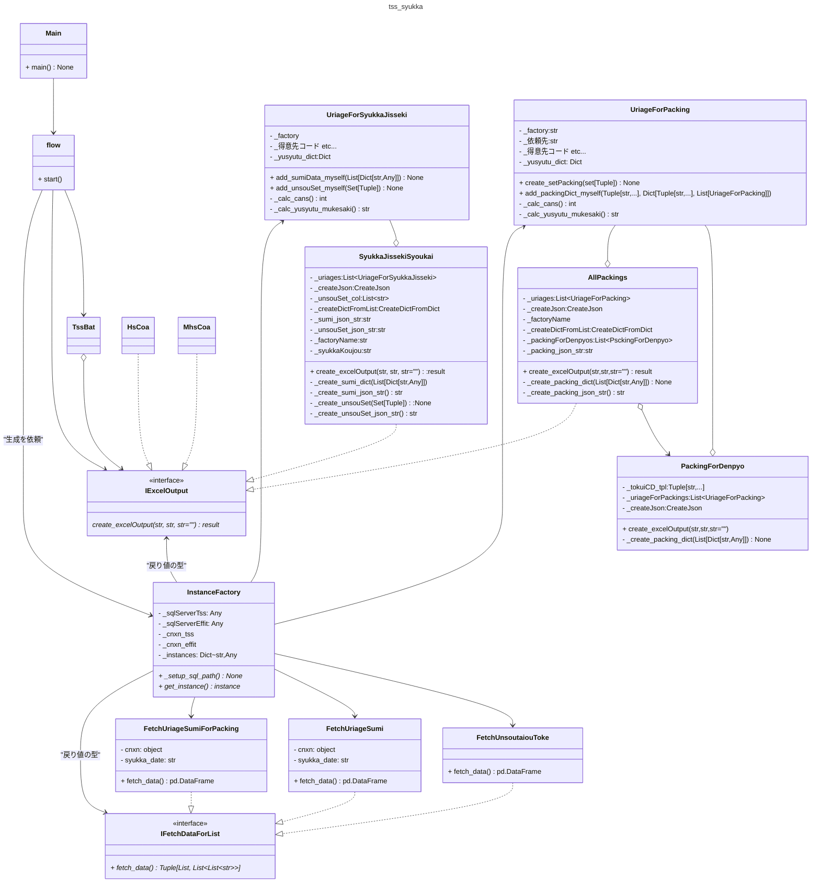
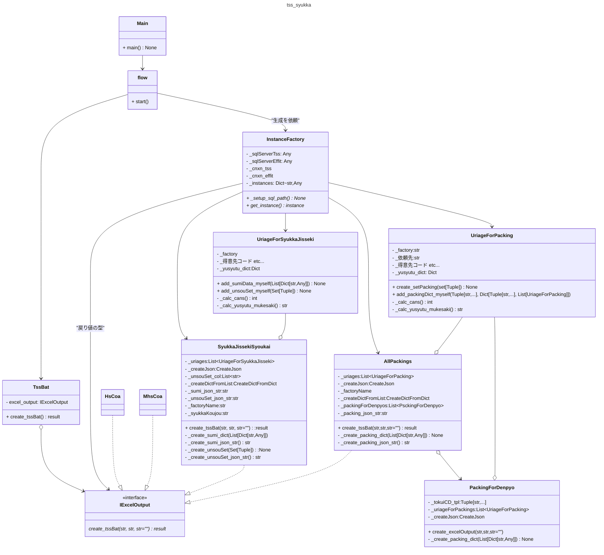

# tss_syukkaについて
## システム概要
### 動作環境
- OS  
    - Windows11(main.py)
- インストール先
    - 尾頭PC WSL2(Ubuntu)で開発
### 構築システム
- メインシステム: Python3.10
- Windowsスクリプト(   )
### ソースコード
GitHub Publicリポジトリで公開 
[GitHub_ https://github.com/ogashira/tss_syukka](https://github.com/ogashira/tss_syukka)
### 起動方法
##### soukoidou
- `Winボタン+R -> tss_syukka入力 -> Enter`または`cmdにて、 pushd \\wsl$\Ubuntu\home\oga\projects\tss_syukka\`デイレクトリ内にて`python main.py`で実行
### 動作

### クラス図

1. flowは、InstanceFactoryからIFetchDataForListクラスのインスタンスをもらって必要なデータを得る。
1. flowは、UriageForSyukkaJissekiのインスタンスを生成し、
