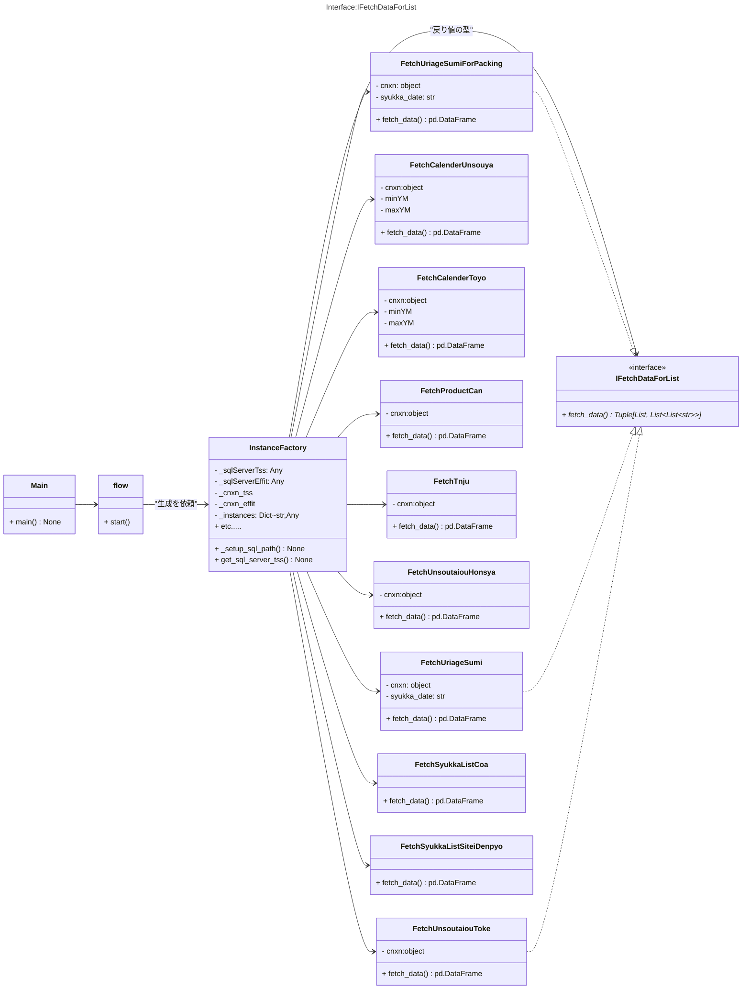
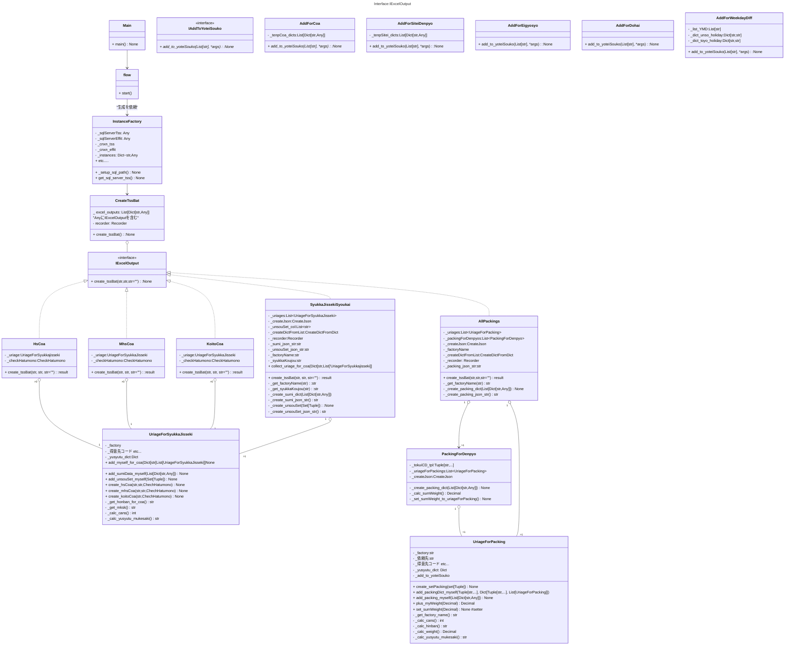

# tss_syukkaについて
## システム概要
### 動作環境
- OS  
    - Windows11(main.py)
- インストール先
    - 尾頭PC WSL2(Ubuntu)で開発
### 構築システム
- メインシステム: Python3.10
- Windowsスクリプト(   )
### ソースコード
GitHub Publicリポジトリで公開 
[GitHub_ https://github.com/ogashira/tss_syukka](https://github.com/ogashira/tss_syukka)
### 起動方法
##### tss_syukka
- `Winボタン+R -> tss_syukka入力 -> Enter`または`cmdにて、 pushd \\wsl$\Ubuntu\home\oga\projects\tss_syukka\`デイレクトリ内にて`python main.py`で実行
### 動作

### クラス図

1. flowは、InstanceFactoryからIFetchDataForListクラスのインスタンスをもらって必要なデータを得る。
1. flowは、SyukkaJissekiSyoukai_toke, SyukkaJissekiSyoukai_honsyaのインスタンスを得る。これらインスタンスはUriageForSyukkajissekiのインスタンスのリスト(toke, honsya)を持っている。
1. flowは、AllPackings_honsya,AllPackings_tokeのインスタンスを得る。AllPackingsはUriageForPackingのインスタンスのリストを持っている。
1. AllPackingsは必要なUriageForPackingのインスタンスを渡して、PackingForDenpyoのインスタンスのリストを作って保持する。
1. PackingForDenpyoインスタンスは国内は「得意先コード、納入先コード」毎に、輸出は「得意先コード、納入先コード、注番」毎に存在する。
1. flowはHsCoa,MhsCoaクラスのインスタンスを得る。これらインスタンスはUriageForSyukkaJissekiのインスタンスのリストを持つ。
1. SyukkaJissekiSyoukai_toke, SyukkaJissekiSyoukai_honsya,AllPackings_toke, AllPackings_toke,HsCoa,MhsCoaはIExcelOutputインターフェースの実装であり、CreateTssBatクラスが保持している。
1. flowはCreateTssBatのインスタンスを生成し、create_tssBatメソッドを呼び出して、「出荷実績照会」、「業務_packing」、「検査成績書」を作成する。

